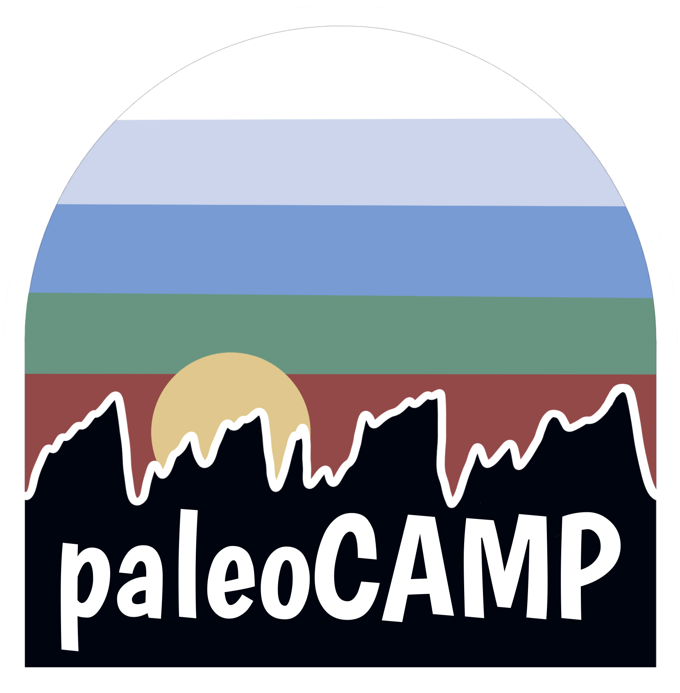

  

# Python for paleoCAMP

This repository holds notebooks and related files associated with data analysis tutorials for the Paleoclimate Training in Climate Archives, Models, and Proxies summer school ([paleoCAMP](https://paleoclimate.camp/)).  

## Setting up Google CoLaboratory

At paleoCAMP we use Google Colaboratory (or "Colab") for our tutorials and analytical exercises.  Colab is a free, cloud-based platform that allows you to run Python code directly in your web browser (and, with a little coaxing, R code too).  This means that no installation or setup is required on your individual machine, which minimizes challenges associated with different hardware and operating systems.  Colab is built around the [Jupyter Notebook](https://jupyter.org/) format, which allows code, explanatory text, images, and results to be combined in a single and easily shareable document.  Working in Colab means that every one at paleoCAMP is using an identical computing environment and using cloud-based computing power.  We will share the tutorial notebooks and the associated data with you via Google Drive during your two weeks in Mammoth Lakes.

Here's how to get started using Colab.  Many universities use Google for student and faculty email accounts, and if this is the case for yours then you can use that account to access Colab. If not, you'll need a personal Google account: 

1. Go to [colab.research.google.com](colab.research.google.com) while signed into your university (or personal) Google account.
2. If Colab loads normally, you're all set!  It is that simple. 
3. If access is blocked or restricted for your university account, try one of the following:
    1. Contact your university's IT department and ask them to enable Google Colaboratory for your account or domain.
    2. Alternatively, sign in with a personal Gmail account and use Colab from there.

We recommend everyone try and get Colab running before arriving at paleoCAMP, in case you run into any challenges. 

## Introduction to Python for paleoCAMP

This repository has two Jupyter notebooks that provide an overview of how Python works that can provide a good introduction before you arrive in Mammoth Lakes.  The two notebooks are:

- [Introduction to Python for Paleoclimate Science — Part 1: Python, NumPy, and Pandas](https://github.com/kanchukaitis/paleoCAMP/blob/main/python_for_climate_part1.ipynb)
- [Introduction to Python for Paleoclimate Science — Part 2: Xarray, Matplotlib, and Cartopy](https://github.com/kanchukaitis/paleoCAMP/blob/main/python_for_climate_part2.ipynb)

The links above take you to the files in this repositorye in Preview mode.  You will not be able to run the code here in Github directly, but each notebook has a button at the very top that will open it in directly in your Google Colab.  You can also use the following links to open the notebooks directly in Colab:

- [Open 'Introduction to Python for Paleoclimate Science — Part 1: Python, NumPy, and Pandas' in Google CoLab](https://colab.research.google.com/github/kanchukaitis/paleoCAMP/blob/main/python_for_climate_part1.ipynb)
- [Open 'Introduction to Python for Paleoclimate Science — Part 2: Xarray, Matplotlib, and Cartopy' in Google CoLab](https://colab.research.google.com/github/kanchukaitis/paleoCAMP/blob/main/python_for_climate_part2.ipynb)

